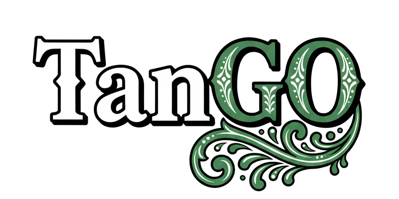

  

# Descripción del Proyecto
**TanGo** es una plataforma de viajes y reseñas de destinos turísticos que combina un backend robusto con un frontend moderno.

## Componentes principales:
### Frontend (Next.js/TypeScript)
- Características: búsqueda de hoteles, restaurantes, lugares de interés
- Incluye funcionalidad de autenticación (login/register)
- Sistema de notificaciones y panel de favoritos
- Mapas interactivos para visualizar ubicaciones
- Soporte de IA integrado usando Gemini: chatbot para sugerencias inteligentes

### Backend (Java/Spring)
- API REST para gestionar datos de usuarios, lugares, reseñas y reportes
- Sistema de autenticación y autorización
- Gestión de métricas y sugerencias
- Base de datos MongoDB para almacenar información de hoteles, restaurantes y actividades

## Características principales:
🔍 Búsqueda y filtrado de lugares turísticos
⭐ Sistema de reseñas y calificaciones
💬 Chatbot con IA para sugerencias de viaje
🗺️ Mapas de ubicación
📱 Panel de usuario 
🔔 Sistema de notificaciones
📊 Dashboard de propietarios para gestionar sus establecimientos
📈 Métricas y análisis para dueños de negocios

## Plataforma bidireccional:
- **Usuarios viajeros**: pueden buscar, reseñar y calificar lugares turísticos, interactuar con la comunidad y además de recibir sugerencias personalizadas con IA
- **Propietarios/dueños**: pueden publicar y administrar sus hoteles, restaurantes y atracciones turísticas, visualizar reseñas y sugerencias de mejora

En esencia, es una aplicación tipo TripAdvisor/Google Maps especializada en conectar viajeros con proveedores de servicios turísticos, permitiendo que los viajeros descubran y comenten sobre destinos mientras que los propietarios gestionan sus negocios y reciben retroalimentación valiosa.